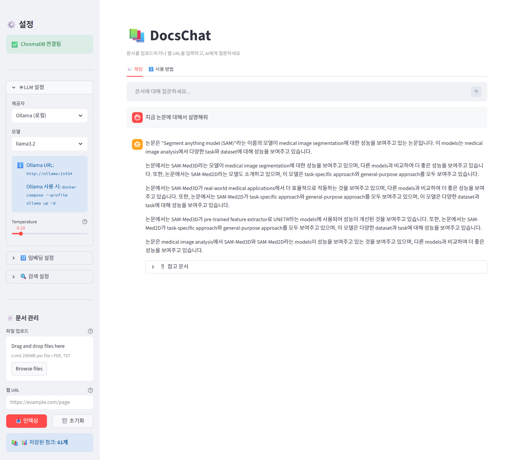

# 📚 DocsChat

> Document-based RAG (Retrieval-Augmented Generation) Chat Service
> LangChain + ChromaDB + Docker Compose + Streamlit

---

## Overview

DocsChat is a RAG chat service that lets you upload various documents such as PDFs, TXT files, and web pages, and have AI-powered conversations based on the content of those documents.

```
┌─────────────────────────────────────────────────────────────┐
│  User Question                                               │
│      │                                                       │
│      ▼                                                       │
│  [ChromaDB Search] ──► [Relevant Document Chunks]            │
│      │                      │                               │
│      └──────────────────────►                               │
│                             ▼                               │
│                        [RAG Prompt]                          │
│                             │                               │
│                             ▼                               │
│                    [LLM (GPT/Claude/Gemini/Ollama)]          │
│                             │                               │
│                             ▼                               │
│                        [Streaming Answer]                    │
└─────────────────────────────────────────────────────────────┘
```

---

## Features

- **Multiple Document Formats**: PDF, TXT, Web URL
- **LLM Selection**: OpenAI GPT / Anthropic Claude / Google Gemini / Ollama (local)
- **Embedding Selection**: HuggingFace (free/local) / OpenAI (paid)
- **Vector DB**: ChromaDB (Docker HTTP server mode, persistent data)
- **Streaming Responses**: Real-time answer generation
- **Source Display**: Shows document chunks that the answer is based on
- **Docker Compose**: One-click deployment

---

## Quick Start

### 1. Clone the Repository

```bash
git clone https://github.com/DocsChat.git
cd DocsChat
```

### 2. Set Environment Variables

```bash
cp .env.example .env
```

Edit the `.env` file to set your API Keys:

```env
# Only set the API Key for the LLM provider you want to use
OPENAI_API_KEY=sk-...        # For OpenAI
ANTHROPIC_API_KEY=sk-ant-... # For Anthropic
GOOGLE_API_KEY=AIza...       # For Google
```

### 3. Run the Service

```bash
# Basic run (ChromaDB + Streamlit app)
docker compose up -d

# View logs
docker compose logs -f app
```

### 4. Open in Browser

```
http://localhost:8502
```

> **If you need to change the port**: If 8502 is already in use, change `"8502:8501"` in `docker-compose.yml` to your preferred port.

---

## How to Use

### Document Indexing

1. Set **LLM settings** in sidebar (provider, model, API Key)
2. **Upload files** (PDF, TXT) or enter a **web URL**
3. Click the **📥 Index** button
4. Confirm the indexing completion message

### Chat

1. Enter your question in the chat input
2. AI searches relevant documents and responds with streaming
3. Check the reference in **📎 Source Documents** at the bottom of the answer

---

## Supported LLMs

| Provider | Models | API Key | Features |
|--------|------|---------|------|
| **OpenAI** | gpt-4o-mini, gpt-4o | Required | Fast, low cost |
| **Anthropic** | claude-3-5-sonnet-20241022 | Required | Long context |
| **Google** | gemini-1.5-flash, gemini-1.5-pro | Required | Free tier available |
| **Ollama** | llama3.2, mistral, etc. | Not required | Fully local execution |

---

## Ollama (Local LLM) Usage

```bash
# Run with Ollama
docker compose --profile ollama up -d

# Download a model (e.g., llama3.2)
docker exec -it docschat-ollama ollama pull llama3.2

# List available models
docker exec -it docschat-ollama ollama list
```

---

## Supported Embeddings

| Provider | Default Model | Cost | Features |
|--------|---------|------|------|
| **HuggingFace** | all-MiniLM-L6-v2 | Free | Local execution, initial download required |
| **OpenAI** | text-embedding-3-small | Paid | High performance, API call |

> HuggingFace embedding models are automatically downloaded on first run and cached in a Docker volume.

---

## Architecture

```
DocsChat/
├── app.py                     # Streamlit main app
├── core/
│   ├── document_loader.py     # TXT/PDF/Web document loader
│   ├── embeddings.py          # Embedding factory
│   ├── llm_factory.py         # LLM factory
│   ├── vector_store.py        # ChromaDB connection/management
│   └── rag_engine.py          # RAG pipeline (LCEL)
├── config/
│   └── settings.py            # Environment variable-based settings
├── docs/
│   ├── plan.md                # Implementation plan and process
│   ├── vector_db.md           # Vector DB comparison
│   ├── demo.md                # Demo guide
│   └── service.md             # Service setup guide
├── docker-compose.yml
├── Dockerfile
├── requirements.txt
└── .env.example
```

---

## Docker Compose Services

| Service | Image | Port | Description |
|--------|--------|------|------|
| `chromadb` | chromadb/chroma:latest | 8000 | Vector DB |
| `app` | (local build) | **8502**→8501 | Streamlit UI |
| `ollama` | ollama/ollama:latest | 11434 | Local LLM (optional) |

### Volumes

| Volume | Purpose |
|------|------|
| `chroma_data` | ChromaDB document data (persistent) |
| `huggingface_cache` | HuggingFace embedding model cache |
| `ollama_models` | Ollama LLM model storage |

---

## Environment Variables

| Variable | Default | Description |
|------|--------|------|
| `LLM_PROVIDER` | `openai` | LLM provider |
| `LLM_MODEL` | (provider default) | LLM model name |
| `OPENAI_API_KEY` | - | OpenAI API Key |
| `ANTHROPIC_API_KEY` | - | Anthropic API Key |
| `GOOGLE_API_KEY` | - | Google API Key |
| `EMBEDDING_PROVIDER` | `huggingface` | Embedding provider |
| `EMBEDDING_MODEL` | `all-MiniLM-L6-v2` | Embedding model |
| `CHROMA_HOST` | `chromadb` | ChromaDB host |
| `CHROMA_PORT` | `8000` | ChromaDB port |
| `CHROMA_COLLECTION` | `docschat` | Collection name |
| `OLLAMA_HOST` | `ollama` | Ollama host |
| `OLLAMA_PORT` | `11434` | Ollama port |

---

## Local Development (Without Docker)

```bash
# Run ChromaDB with Docker
docker run -d -p 8000:8000 chromadb/chroma:latest

# Create Python virtual environment
python -m venv .venv
source .venv/bin/activate  # Windows: .venv\Scripts\activate

# Install PyTorch CPU (for HuggingFace embeddings)
pip install torch --index-url https://download.pytorch.org/whl/cpu

# Install dependencies
pip install -r requirements.txt

# Set environment variables (CHROMA_HOST to localhost)
export CHROMA_HOST=localhost

# Run
streamlit run app.py
```

---

## Useful Commands

```bash
# Check service status
docker compose ps

# View app logs
docker compose logs -f app

# View ChromaDB logs
docker compose logs -f chromadb

# Stop services
docker compose down

# Full removal including data (caution: indexed documents will be deleted)
docker compose down -v

# Rebuild image (after code changes)
docker compose up -d --build app

# Direct ChromaDB API access
curl http://localhost:8000/api/v1/heartbeat
```

---


## License

This project is licensed under the MIT License.

---

## Screenshots



---


## Related Documentation

- [Implementation Plan and Process](docs/plan.md)
- [Vector DB Comparative Analysis](docs/vector_db.md)
- [Vector DB Docker Configuration](docs/vector_db_docker.md)
- [Demo UI Guide](docs/demo.md)
- [Service Setup Guide](docs/service.md)

---

## Tech Stack

- [LangChain](https://python.langchain.com) - RAG framework
- [ChromaDB](https://docs.trychroma.com) - Vector database
- [Streamlit](https://streamlit.io) - Web UI
- [sentence-transformers](https://sbert.net) - HuggingFace embeddings
- [Docker Compose](https://docs.docker.com/compose) - Container orchestration
